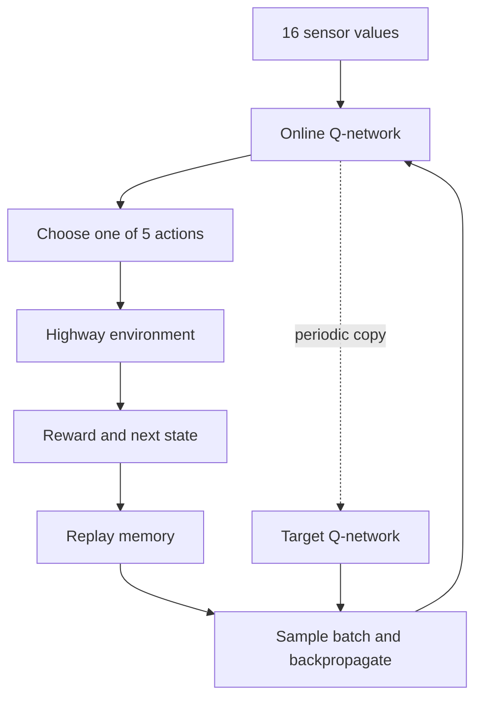

# AutoDrive RL Lab

An educational autonomous-driving simulation that shows a car learning to move
through three lanes of traffic. It is deliberately small enough to understand
end to end: the highway physics, range sensors, rewards, neural network,
backpropagation, replay memory, and DQN training loop all live in this project.

This is a learning simulation, not software for controlling a real vehicle.

## What is already implemented

- A top-down desktop simulation with three lanes and moving traffic
- Five discrete actions: maintain, accelerate, brake, steer left, steer right
- Front/rear distance and relative-speed sensors for every lane
- Collision, road-boundary, following-distance, speed, and lane-position logic
- A Double DQN written directly with NumPy, including neural-network backpropagation
- Random, manual, rule-based, and learned-agent driving modes
- Curriculum training: lane keeping, then light traffic, then full traffic
- CSV training metrics and separate deterministic evaluation episodes
- Automated tests for the environment, replay buffer, network, and model files

## Quick start

Python 3.10 or newer is recommended.

```bash
python -m venv .venv
```

Activate it on macOS or Linux:

```bash
source .venv/bin/activate
```

Activate it on Windows PowerShell:

```powershell
.venv\Scripts\Activate.ps1
```

Install the one Python dependency:

```bash
python -m pip install -r requirements.txt
```

Open an immediate visual demonstration driven by a rule-based policy:

```bash
python -m autodrive_rl
```

The visualizer uses Python's built-in Tkinter desktop toolkit. Python installers
from python.org normally include it. On some Linux systems, it is a separate
`python3-tk` OS package.

## Drive it yourself

```bash
python -m autodrive_rl.play --policy manual
```

- W or Up: accelerate
- S or Down: brake
- A or Left: steer left
- D or Right: steer right
- P: pause
- R: restart
- Q or Escape: quit

Only one action is chosen per simulation step. That matches the DQN's discrete
action space.

## Train the agent

A short pipeline check:

```bash
python -m autodrive_rl.train --episodes 40
```

A real first training run:

```bash
python -m autodrive_rl.train --episodes 300
```

The command writes:

- `models/autodrive_dqn.npz`: final network
- `models/autodrive_dqn_best.npz`: best evaluation checkpoint
- `runs/training_metrics.csv`: per-episode results

Watch the best trained policy:

```bash
python -m autodrive_rl.play --policy dqn --model models/autodrive_dqn_best.npz
```

Training is stochastic. A short run proves the loop works but usually does not
produce a reliable driver. Use a few hundred episodes before judging the DQN.

## Compare policies

```bash
python -m autodrive_rl.play --policy random
python -m autodrive_rl.play --policy heuristic
python -m autodrive_rl.play --policy dqn --model models/autodrive_dqn_best.npz
```

The heuristic is not reinforcement learning. It is a useful upper baseline:
if the DQN improves beyond random driving and approaches the heuristic, the
training experiment is moving in the right direction.

## Vary the world

Scenario presets control traffic density, static obstacles, and how many
drivers react (brake on short headway, change lanes when blocked):

```bash
python -m autodrive_rl.play --policy heuristic --scenario-preset dense
python -m autodrive_rl.play --policy dqn --model models/autodrive_dqn_best.npz --scenario-preset sparse
```

Presets: `sparse` (4 cars), `normal` (today's 9-car world), `dense`
(14 cars, 2 obstacles, half the drivers reactive), `random`. Override any
field with `--traffic N`, `--obstacles N`, or `--reactive F` (0 to 1).

Training now uses domain randomization by default: after the warm-up
curriculum, every episode rolls fresh conditions from the `random` ranges,
and periodic evaluations run a sparse/normal/dense matrix. The best
checkpoint is the one with the highest mean return across that matrix. Use
`--scenario-preset normal` to reproduce the old fixed-world training.

## The learning loop



Each transition has the form:

```text
(state, action, reward, next_state, done)
```

The online network selects the next action and the target network estimates its
long-term value. Separating selection from evaluation reduces overly optimistic
Q-values while keeping the learning loop compact.

## State, action, and reward

The 16-element state contains:

| Indices | Sensor values |
| --- | --- |
| 0–3 | road position, lateral speed, forward speed, nearest-lane offset |
| 4–6 | front gap in lanes 1–3 |
| 7–9 | rear gap in lanes 1–3 |
| 10–12 | front-car relative speed in lanes 1–3 |
| 13–15 | rear-car relative speed in lanes 1–3 |

All values are normalized to roughly `[-1, 1]`.

Positive reward comes from forward progress, useful speed, and staying near a
lane center. Dense penalties warn about short time-to-collision, unsafe target
lanes, and road edges before a crash occurs. Collisions and leaving the road
receive much larger terminal penalties. Run `env.last_reward_terms` after a
step to inspect the exact breakdown.

## Project map

| File | Purpose |
| --- | --- |
| `autodrive_rl/environment.py` | Road, ego car, traffic, sensors, reward, transitions |
| `autodrive_rl/dqn.py` | Replay buffer, neural network, backprop, Adam, DQN agent |
| `autodrive_rl/train.py` | Curriculum, training, evaluation, checkpoints, CSV metrics |
| `autodrive_rl/renderer.py` | Live top-down desktop visualization |
| `autodrive_rl/play.py` | Manual, random, heuristic, and DQN playback |
| `autodrive_rl/heuristic.py` | Rule-based comparison policy |
| `tests/` | Behavioral and learning-component tests |
| `LEARNING_GUIDE.md` | Guided walkthrough and suggested experiments |
| `BENCHMARK.md` | Held-out results for the included trained checkpoints |

## Run verification

```bash
python -m unittest discover -s tests -v
```

## Sensible expansion path

1. Plot learning curves and compare at least three random seeds.
2. Add static obstacles and denser traffic difficulty levels.
3. Add lane-change intent and a penalty for unsafe rear gaps.
4. Add prioritized replay and a dueling-network head.
5. Add curved roads and intersections.
6. Replace exact numeric gaps with noisy simulated lidar/radar readings.
7. Only then experiment with camera pixels and a convolutional network.

That progression preserves a testable baseline at every stage instead of
jumping directly into a costly visual-perception problem.

## Reference material

- [Gymnasium custom-environment interface](https://gymnasium.farama.org/introduction/create_custom_env/)
- [PyTorch's official DQN tutorial](https://docs.pytorch.org/tutorials/intermediate/reinforcement_q_learning.html)
- [Pygame documentation](https://www.pygame.org/docs/) for a possible future renderer upgrade
