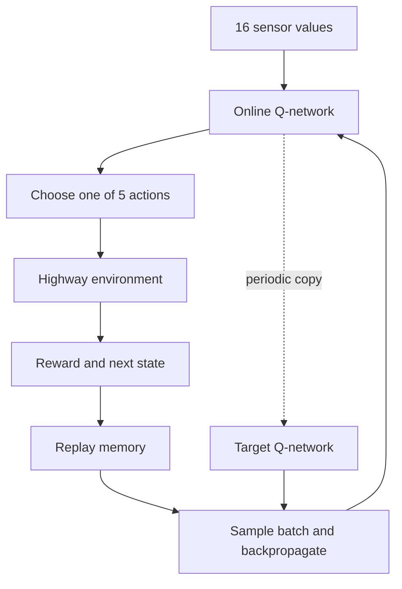

# AutoDrive RL Lab

An educational autonomous-driving simulation that shows a car learning to move
through three lanes of traffic. It is deliberately small enough to understand
end to end: the highway physics, range sensors, rewards, neural network,
backpropagation, replay memory, and DQN training loop all live in this project.

This is a learning simulation, not software for controlling a real vehicle.

## What is already implemented

- A top-down desktop simulation with three lanes and moving traffic
- Five discrete actions: maintain, accelerate, brake, steer left, steer right
- Front/rear distance and relative-speed sensors for every lane
- Collision, road-boundary, following-distance, speed, and lane-position logic
- A Double DQN written directly with NumPy, including neural-network backpropagation
- Random, manual, rule-based, and learned-agent driving modes
- Curriculum training: lane keeping, then light traffic, then full traffic
- CSV training metrics and separate deterministic evaluation episodes
- A desktop launcher: every mode as a form, with live output and a Stop button
- Behavior cloning from recorded human driving, and a benchmark harness that
  scores any policy on identical held-out worlds by difficulty
- Automated tests for the environment, replay buffer, network, and model files

## Quick start

Python 3.10 or newer is recommended.

```bash
python -m venv .venv
```

Activate it on macOS or Linux:

```bash
source .venv/bin/activate
```

Activate it on Windows PowerShell:

```powershell
.venv\Scripts\Activate.ps1
```

Install the Python dependencies (NumPy for the simulation, MLflow for experiment tracking):

```bash
python -m pip install -r requirements.txt
```

Open the launcher:

```bash
python -m autodrive_rl
```

The window opens on an **Overview** tab explaining what the simulation is, what
the agent senses, what it is rewarded for, and what each of the other tabs does
— so the project explains itself without the README open alongside.

Each mode shows only its everyday settings — who drives, how hard, how fast —
with the rest behind a **More settings** disclosure. The split is by how often a
setting is touched rather than how advanced it is: seeds, paths and overrides
are perfectly ordinary, they are just rarely changed twice in a row. Collapsing
is purely a layout choice; a test asserts the command a panel builds is
identical whether the section is open or shut.

Everything the project can do is a form in that window — drive the simulation,
train an agent, clone your own driving, benchmark policies against each other.
Pick settings, press Run, watch the output stream in. The command being run is
shown above the button, so the interface teaches the command line rather than
hiding it, and every flag below is still available directly in a terminal.

On a machine with no display the launcher steps aside and runs the rule-based
visual demo instead.

The visualizer uses Python's built-in Tkinter desktop toolkit. Python installers
from python.org normally include it. On some Linux systems, it is a separate
`python3-tk` OS package.

## Drive it yourself

```bash
python -m autodrive_rl.play --policy manual
```

- W or Up: accelerate
- S or Down: brake
- A or Left: steer left
- D or Right: steer right
- P: pause
- R: restart
- N: skip to the next episode
- `+` / `-`: playback speed, from 0.5x to 20x
- Q or Escape: quit

Only one action is chosen per simulation step. That matches the DQN's discrete
action space.

## Watch it learn

A 900-step episode is 90 seconds of real time, which is far too slow to sit
through while a policy improves. Two flags fix that.

Draw every Nth training episode, at up to 20x, while everything in between runs
headless at full speed:

```bash
python -m autodrive_rl.train --episodes 600 --render-every 25 --render-speed 10
```

The live view is **strictly observational**. It reads the environment and
nothing else — it consumes no randomness and reorders no step, so a seeded run
produces byte-identical weights whether or not you watched it. That is asserted
by a test rather than assumed, because this project has already been bitten once
by a single misplaced random draw desynchronising every seeded world.

Better still, save a checkpoint every N episodes and replay the whole run
afterwards as a single clip:

```bash
python -m autodrive_rl.train --episodes 600 --snapshot-every 50
python -m autodrive_rl.play --model-sequence "models/autodrive_dqn_ep*.npz" --speed 10
```

Each snapshot drives one episode, in training order, captioned with how many
episodes of experience it had at the time. It goes from crashing immediately, to
wandering, to driving — which is the clearest single view of what the training
loop actually does. Snapshots are zero-padded (`_ep0050`, `_ep0100`) so the glob
orders correctly.

## Train the agent

A short pipeline check:

```bash
python -m autodrive_rl.train --episodes 40
```

A real first training run:

```bash
python -m autodrive_rl.train --episodes 300
```

The command writes:

- `models/autodrive_dqn.npz`: final network
- `models/autodrive_dqn_best.npz`: best evaluation checkpoint
- `runs/training_metrics.csv`: per-episode results

Watch the best trained policy:

```bash
python -m autodrive_rl.play --policy dqn --model models/autodrive_dqn_best.npz
```

Training is stochastic. A short run proves the loop works but usually does not
produce a reliable driver. Use a few hundred episodes before judging the DQN.

## Track your experiments

Every training run is logged to a local MLflow store in `mlruns/` (no
account, no network): the full configuration, the git commit, per-episode
curves (return, distance, crash rate, epsilon, loss), the evaluation
matrix, and the saved model files. Open the dashboard with:

```bash
mlflow ui
```

then visit http://localhost:5000 to browse runs, plot metrics, and compare
training runs side by side. Opt out of tracking for a single run with:

```bash
python -m autodrive_rl.train --episodes 300 --no-tracking
```

## Compare policies

```bash
python -m autodrive_rl.play --policy random
python -m autodrive_rl.play --policy heuristic
python -m autodrive_rl.play --policy dqn --model models/autodrive_dqn_best.npz
```

The heuristic is not reinforcement learning. It is a useful upper baseline:
if the DQN improves beyond random driving and approaches the heuristic, the
training experiment is moving in the right direction.

## Vary the world

Scenario presets control traffic density, static obstacles, and how many
drivers react to other cars (brake on short headway, change lanes when
blocked); all drivers brake for obstacles:

```bash
python -m autodrive_rl.play --policy heuristic --scenario-preset dense
python -m autodrive_rl.play --policy dqn --model models/autodrive_dqn_best.npz --scenario-preset sparse
```

Presets: `sparse` (4 cars), `normal` (9 cars), `dense` (16 cars plus 2
slow-moving vehicles, half the drivers reactive), `unforgiving`, `random`.
Override any field with `--traffic N`, `--slow-vehicles N`, `--obstacles N`,
or `--reactive F` (0 to 1).

### World model v2: what the world punishes

Three rules were added so the simulation penalises what a real motorway
penalises, rather than what is easy to measure.

**Static obstacles are gone.** They used to drop immovable blocks into live
lanes with traffic queued behind them, which does not happen on a motorway and
turned out to be the single biggest distortion in the project — see the lab
notes. Slow-moving vehicles (6-9 m/s in a 29 m/s flow) replace them: the same
"plan ahead and change lanes" problem, without the physics fiction. The
`obstacle` behaviour still exists for the lane-keeping scenario.

**Stalling ends the episode.** Sitting below `stall_speed_mps` for longer than
`stall_grace_s` *with a clear lane ahead* is obstruction, and it terminates the
run as its own kind of failure with its own column in the benchmark. The
clear-lane condition is what separates it from ordinary driving: stopping
behind a queue is normal, stopping on an open motorway is not. Calibration is
pinned by a test — the rule-based driver must never trigger it, because if it
does the threshold is wrong rather than the driver.

**Collisions are attributed.** Running into something ahead, or merging into
someone, is the ego's fault and costs the full penalty. Being struck from
behind while driving normally is the follower's failure and costs much less —
not nothing, because a car that stops caring about being hit stops watching its
mirrors, but far less than a crash it caused. Being struck from behind *while
stopped in a live lane* is the ego's fault, because stopping there is the
unreasonable act. The benchmark reports at-fault collisions separately, which
is the honest measure of whether a policy drives well rather than whether it
got lucky with the traffic around it.

### `unforgiving`: where standing still is not safe

Traffic also spawns *behind* the ego and catches up at its own cruise speed,
and 60% of drivers are **inattentive** — they act on a view of the road
`reaction_delay_s` (1.5 s) stale, long enough that a car stopping in front of
them cannot always be avoided. An attentive follower can always avoid a car
that stops; the delay is the danger, not the density. Results:
`BENCHMARK_unforgiving.md`.

Training now uses domain randomization by default: after the warm-up
curriculum, every episode rolls fresh conditions from the `random` ranges,
and periodic evaluations run a sparse/normal/dense matrix. The best
checkpoint is the one with the highest mean return across that matrix. Use
`--scenario-preset normal` to reproduce the old fixed-world training.

## The learning loop


```mermaid
flowchart TD
    S["16 sensor values"] --> Q["Online Q-network"]
    Q --> A["Choose one of 5 actions"]
    A --> E["Highway environment"]
    E --> T["Reward and next state"]
    T --> R["Replay memory"]
    R --> U["Sample batch and backpropagate"]
    U --> Q
    Q -. "periodic copy" .-> G["Target Q-network"]
    G --> U
```

Each transition has the form:

```text
(state, action, reward, next_state, done)
```

The online network selects the next action and the target network estimates its
long-term value. Separating selection from evaluation reduces overly optimistic
Q-values while keeping the learning loop compact.

## State, action, and reward

The 16-element state contains:

| Indices | Sensor values |
| --- | --- |
| 0–3 | road position, lateral speed, forward speed, nearest-lane offset |
| 4–6 | front gap in lanes 1–3 |
| 7–9 | rear gap in lanes 1–3 |
| 10–12 | front-car relative speed in lanes 1–3 |
| 13–15 | rear-car relative speed in lanes 1–3 |

All values are normalized to roughly `[-1, 1]`.

Positive reward comes from forward progress, useful speed, and staying near a
lane center. Dense penalties warn about short time-to-collision, unsafe target
lanes, and road edges before a crash occurs. Collisions and leaving the road
receive much larger terminal penalties. Run `env.last_reward_terms` after a
step to inspect the exact breakdown.

## Project map

| File | Purpose |
| --- | --- |
| `autodrive_rl/environment.py` | Road, ego car, traffic, sensors, reward, transitions |
| `autodrive_rl/dqn.py` | Replay buffer, neural network, backprop, Adam, DQN agent |
| `autodrive_rl/train.py` | Curriculum, training, evaluation, checkpoints, CSV metrics |
| `autodrive_rl/renderer.py` | Live top-down desktop visualization |
| `autodrive_rl/play.py` | Manual, random, heuristic, and DQN playback |
| `autodrive_rl/heuristic.py` | Rule-based comparison policy |
| `autodrive_rl/benchmark.py` | Score any policy on held-out worlds; emits a reproducible table |
| `autodrive_rl/launcher.py` | Desktop launcher — every mode as a form |
| `autodrive_rl/commands.py` | Turns launcher settings into command-line arguments |
| `autodrive_rl/jobrunner.py` | Runs a command as a subprocess and streams its output |
| `tests/` | Behavioral and learning-component tests |
| `LEARNING_GUIDE.md` | Guided walkthrough and suggested experiments |
| `docs/LAB_NOTES.md` | Running log of findings, surprises, and open questions |
| `BENCHMARK_unforgiving.md` | Held-out results including the `unforgiving` cell |
| `BENCHMARK_v1.md` | Held-out results for the pre-v2 world (historical) |
| `BENCHMARK.md` | Held-out results (historical — regenerate with `autodrive_rl.benchmark`) |

## Run verification

```bash
python -m unittest discover -s tests -v
```

## Sensible expansion path

1. Plot learning curves and compare at least three random seeds.
2. Add static obstacles and denser traffic difficulty levels.
3. Add lane-change intent and a penalty for unsafe rear gaps.
4. Add prioritized replay and a dueling-network head.
5. Add curved roads and intersections.
6. Replace exact numeric gaps with noisy simulated lidar/radar readings.
7. Only then experiment with camera pixels and a convolutional network.

That progression preserves a testable baseline at every stage instead of
jumping directly into a costly visual-perception problem.

## Reference material

- [Gymnasium custom-environment interface](https://gymnasium.farama.org/introduction/create_custom_env/)
- [PyTorch's official DQN tutorial](https://docs.pytorch.org/tutorials/intermediate/reinforcement_q_learning.html)
- [Pygame documentation](https://www.pygame.org/docs/) for a possible future renderer upgrade
